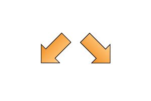

# Contribution Workflow using Pivotal Tracker

 
 
 
New tickets have no status set and can be found in the Icebox column. All new tickets must be voted upon to estimate the effort required and complexity of the ticket.  Voting should take place using `/voter` within the appropriate slack channel.

 

 
   
Once voted on and an estimate assigned the ticket is available in the Backlog column to be assigned to a volunteer.   Once allocated the ticket should be started and is automatically moved to the Current Interation column.

 

 
Whilst working on the ticket the assigned volunteer(s) work in their own fork of the repository and create feature/bug branches that include the Pivotal Tracker ID in the branch name. Additonally a pull-request should be created to share the changes to the code with other volunteers so they can easily comment and help out where necessary.  A hyperlink to the  Pivotal Tracker ticket should be included in the pull-request's description. Additonal information/progress/issues relating to the ticket should be also added to the ticket as a comment. Remember to include sufficient tests to support the ticket.

 

 

  
 
Once work on the ticket is completed a final commit with a commit message in the following format should be submitted:
<pre>
makes Capybara check for visibility more robust [Finishes #112900047]
</pre> 

 

 
 
This will Finish the relevant Pivotal Tracker ticket when the pull-request is merged.

 

 
 
 
Once merged and tested in staging the changes are pushed (delivered) to the production site ready for the client to Accept or Reject.

 

 

